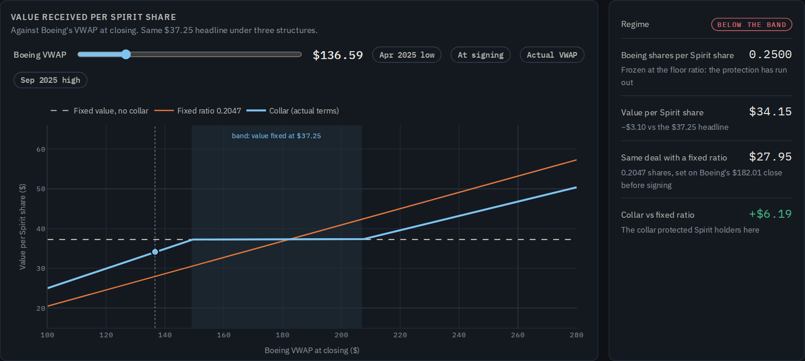
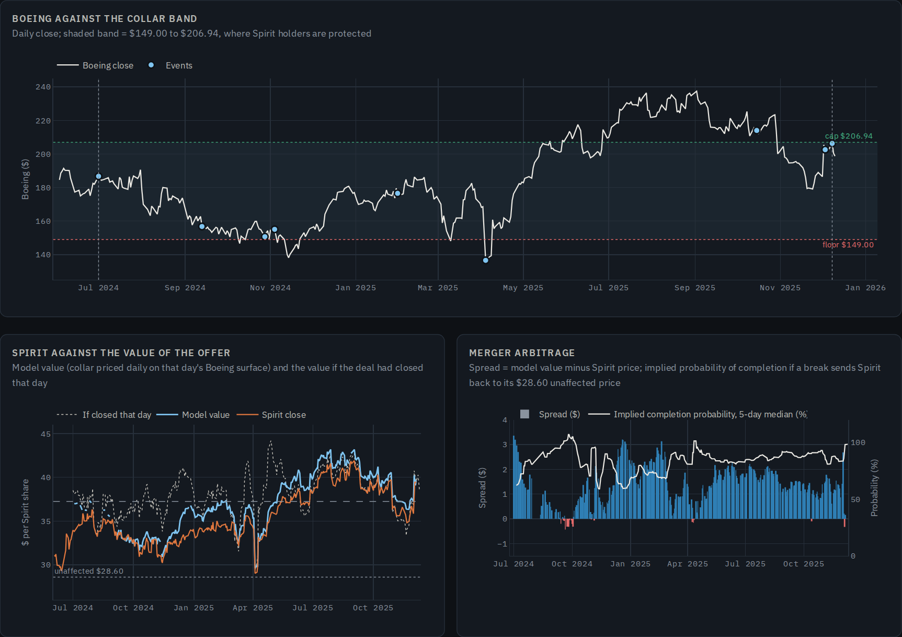
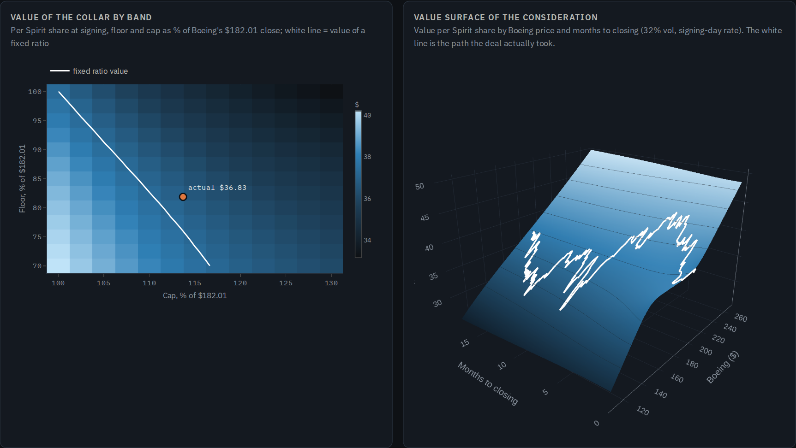

# Boeing–Spirit Merger Analysis: Collar Valuation and Merger Arbitrage

**Author:** Alessandro Radice · M.Sc. Economics and Business Law (Finance), Università Cattolica del Sacro Cuore, Milan

**Live page:** [alessandroradice.github.io/boeing-spirit-merger-analysis](https://alessandroradice.github.io/boeing-spirit-merger-analysis/)

**30 June 2024. Boeing agrees to buy Spirit AeroSystems for $37.25 a share, paid entirely in Boeing stock, with a collar: the value is fixed only while Boeing's 15-day VWAP stays between $149.00 and $206.94. You advise the Spirit board. What is the offer really worth, who carries Boeing's risk until closing, and should the board ask for different terms?**

An M&A structuring case study on a real deal and real market data. It prices the collar as a **package of options on Boeing**, using Boeing's **implied volatility surface rebuilt every trading day from real option quotes (bid and ask)**, compares it with a fixed exchange ratio and a fixed value, searches for a better band, and follows the offer **every trading day for 17 months**, to the closing on 8 December 2025, with the merger-arbitrage spread and the market's implied probability of completion. The main output is an **interactive web page** with a payoff explorer, a 3D value surface and the full timeline. It comes with a Colab notebook, an **Excel collar pricer with live formulas**, an investment memo and a presentation deck.



---

## Objective

A stock-for-stock deal with a collar looks like a price ("$37.25 a share") but is really a set of options. This project:

1. **Prices the offer properly.** $37.25 paid at closing, minus 0.25 puts on Boeing struck at $149.00, plus 0.18 calls struck at $206.94, each at its own implied volatility, with the real settlement mechanics (15-day VWAP, shares delivered two days later).
2. **Judges the structure.** Compares it with a fixed ratio and a fixed value on value and on risk, and finds the floor and cap that would have made the collar as valuable as a fixed ratio.
3. **Checks it against what happened.** Marks the offer daily to closing, measures the merger-arbitrage spread, and rebuilds the final exchange ratio from market data.

---

## Key results

**On signing day** (Boeing $182.01 on 28 June 2024, closing expected mid-2025, one-year implied vol about 32%)

| Structure, same $37.25 headline | Value today | vs fixed ratio | Chance below $37.25 | Worst 5% | Best 5% |
|---|---|---|---|---|---|
| **Collar (actual terms)** | **$36.83** | **−$0.48** | **25%** | $25.58 | $55.03 |
| Fixed exchange ratio (0.2047) | $37.31 | – | 48% | $20.94 | $62.57 |
| Fixed value, no collar | $35.44 | −$1.88 | 0% | $37.25 | $37.25 |

*Rounded to the cent; totals and differences are computed before rounding.*

- **The offer was worth $36.83**: $35.44 for $37.25 paid a year later, −$1.77 for the puts Spirit holders sold below $149, +$3.17 for the calls they kept above $206.94, and −$0.001 for the averaging window (unrounded: $36.8344).
- **The collar cost $0.48 a share against a fixed ratio** (about $60 million) and **halved the chance of receiving less than $37.25**. Fair insurance on a volatile acquirer.
- **The band was tilted towards Boeing**: the floor sat 18% below Boeing, the cap only 14% above. A cap at **$201** or a floor at **$138** would have made the collar worth as much as a fixed ratio.

**Seventeen months to closing**

- Boeing closed **below the $149 floor on 16 of 362 trading days** (strike and equity raise in autumn 2024, tariff sell-off in spring 2025, low $136.59) and above the cap on 98. Realised volatility was 36.9% against 32% implied at signing.
- Spirit traded on average **$1.33 below the value of the offer**: a median **85% implied probability of completion** if a break had sent Spirit back to its $28.60 unaffected price.
- **At closing** the 15-day VWAP was about $190.54, inside the band: **0.1955 Boeing shares per Spirit share** (rebuilt here at 0.1953 from daily data), worth **$40.33** on the closing day. A fixed ratio would have paid $42.22.

**Recommendation to the board: accept the collar, but negotiate the band** (a cap near $201) and add a price-linked walk-away below the floor, where Boeing's real risk sat.



---

## What it does

| Step | Module | What it produces |
|---|---|---|
| 1 | **Data** | Boeing option chains and Boeing / Spirit prices (DoltHub), Treasury yields (FRED) |
| 2 | **Deal terms** | Collar payoff, exchange ratio, 15-day VWAP window, check against the 8-K |
| 3 | **Implied vols** | Put-call-parity spot, Black-76 implied vols from bid, mid and ask |
| 4 | **Boeing surface** | Arbitrage-free raw SVI per expiry, 336 trading days, June 2024 to December 2025 |
| 5 | **Valuation at signing** | Bond − 0.25 puts + 0.18 calls, Monte Carlo of the VWAP settlement |
| 6 | **Alternatives** | Fixed ratio and fixed value, risk-neutral distribution of outcomes, vol stress test |
| 7 | **Negotiation** | Value of other bands, floor and cap that match a fixed ratio |
| 8 | **Seventeen months** | Daily value of the offer, merger-arbitrage spread, implied probability of completion |
| 9 | **Ex post** | What Spirit holders received, VWAP and ratio rebuilt |
| 10 | **Export** | The interactive page `Boeing_Spirit_Collar.html` |
| 11 | **Excel** | The collar pricer `Boeing_Spirit_Collar_Pricer.xlsx`, with live formulas |

### The interactive page

`Boeing_Spirit_Collar.html` opens in any browser:

- **Payoff explorer**: a Boeing slider shows the exchange ratio, the value per Spirit share and the gap to a fixed ratio, with shortcuts to the April 2025 low, the signing price, the actual VWAP and the September 2025 high.
- **Valuation at signing**: from the $37.25 headline to the value today, and the chance of receiving less than any given amount under each structure.
- **Negotiation**: the value of the collar for every floor and cap, and a **3D value surface** (Boeing price × months to closing) with the path the deal actually took.
- **Timeline**: Boeing against the band with the key events, Spirit against the value of the offer, the merger-arbitrage spread and the implied probability of completion.



### The Excel collar pricer (7 tabs)
`Cover` · `Inputs` · `Pricer` · `Scenarios` · `Band grid` · `Paths` · `Checks`

- **Inputs**: deal terms, the 28 June 2024 market (Boeing, Treasury rate, implied vols at the two strikes) and three switches: the Boeing VWAP for the payoff (C6), the expected closing date (C7) and the break price for the implied probability (C8).
- **Pricer**: Black-Scholes value of the puts and calls, the collar against a fixed ratio and a fixed value, and the payoff at any VWAP.
- **Scenarios** and **Band grid**: value by Boeing VWAP, and collar value for floors from 70% to 100% and caps from 100% to 130%.
- **Paths**: every trading day to closing, with the value if the deal had closed that day, the spread and the implied probability.
- **Checks**: 11 reconciliations with the Python engine. Banker colour code: **blue** = input, **black** = formula, **green** = link.

---

## Methodology

- **Terms.** From Spirit's proxy statement: exchange ratio = $37.25 / VWAP between $149.00 and $206.94, fixed at 0.25 below and 0.18 above; VWAP over the 15 trading days ending on the second trading day before the effective time. The final ratio of 0.1955 comes from Spirit's 8-K.
- **Implied vols.** Boeing pays no dividend (suspended since 2020), so `F = S e^(rT)` and American calls equal their European value. Spot from put-call parity at the snapshot, r from the Treasury curve. Black-76 on out-of-the-money options; quotes with a bid below $0.05, a spread above 50% of mid or fewer than 5 days to expiry are dropped (13,944 of 41,166 kept).
- **Surface.** Raw SVI per listed expiry, fitted in vol space with bid-ask weights, a soft-L1 loss and penalties for butterfly arbitrage (g(k) ≥ 0), negative variance, Lee's bound and calendar crossing. Linear in total variance between expiries; beyond the last listed expiry (about 7 weeks) flat ATM vol with √T skew scaling. Mean fit error 0.54 vol points.
- **Collar value.** `V = 37.25·e^(−rT) − 0.25·Put(149) + 0.18·Call(206.94)`, each option at its own implied vol. A Monte Carlo of the actual settlement (average of 15 closes, shares at closing) gives the averaging correction (−$0.001 at signing).
- **Outcomes.** Risk-neutral distribution of Boeing at closing from the surface (Breeden-Litzenberger), 400,000 draws.
- **Daily marks and arbitrage.** Collar repriced on each day's surface with the actual closing date. Spread = model value − Spirit; implied probability `p = (Spirit − 28.60) / (value − 28.60)`.

## Limitations

- The listed Boeing options reach only about seven weeks, so the one-year volatility is an extrapolation. With any flat vol from 25% to 45% the collar stays $0.23 to $0.45 below a fixed ratio and far less likely to pay under $37.25; the dollar figures move with the assumption.
- Early exercise of the out-of-the-money Boeing puts is ignored (no dividend; the premium is small).
- The VWAP is rebuilt from daily high, low, close and volume, not intraday trades; it lands within 0.1% of the actual ratio.
- Daily marks use the actual closing date with hindsight; the implied probability depends on the assumed break price.
- Spirit's own risks during the wait (the Airbus carve-out, regulatory remedies, funding) are not priced.

This project is for educational purposes and is not investment advice.

---

## What you need

| Requirement | Details |
|---|---|
| **Environment** | A Google account to run the notebook in [Google Colab](https://colab.research.google.com), free tier is enough. It also runs in any local Jupyter with Python 3.10+. |
| **Python libraries** | `pandas`, `numpy`, `scipy`, `matplotlib`, `requests`, `openpyxl`. The first cell installs what is missing. |
| **Data** | Bundled in `data/`. If the folder is missing, the notebook downloads everything from DoltHub and FRED (several minutes). |
| **To open the outputs** | Any modern browser for the page (it loads Plotly and the fonts from public CDNs); Microsoft Excel or Google Sheets; any PDF reader. |
| **Background knowledge** | Stock-for-stock M&A consideration, exchange ratios, Black-Scholes and implied volatility. |

## How to run it

1. Open `Boeing_Spirit_Collar_Analysis.ipynb` in Google Colab and upload the `data/` folder next to it (otherwise the data are downloaded).
2. `Runtime → Run all`. The daily SVI fits are read from `data/svi_fits.json`; set `REFIT = True` in the Configuration cell to refit all 336 days (about 50 minutes).
3. Change the terms in the Configuration cell (floor, cap, ratios, dates) to price another collar.
4. The last two cells write `Boeing_Spirit_Collar.html` and `Boeing_Spirit_Collar_Pricer.xlsx` and, in Colab, download them.
5. In Excel, change the yellow switches on `Inputs` or any blue cell.

---

## Repository structure

```
├── Boeing_Spirit_Collar_Analysis.ipynb   # the notebook (run this)
├── boeing_spirit_collar_analysis.py      # same code as a plain Python script
├── Boeing_Spirit_Collar.html             # interactive page
├── index.html                            # same page, served by GitHub Pages as the live link
├── Boeing_Spirit_Collar_Pricer.xlsx      # Excel collar pricer with live formulas and switches
├── Boeing_Spirit_Collar_Memo.pdf         # investment memo to the Spirit board
├── Boeing_Spirit_Collar_Deck.pdf         # seven-slide presentation
├── data/
│   ├── ba_options_raw.csv                # Boeing option chains, Jun 2024 to Dec 2025 (bid, ask, vendor IV, delta)
│   ├── ohlcv_BA_SPR.csv                  # Boeing and Spirit daily prices and volumes
│   ├── fred_treasury.csv                 # 1M to 2Y Treasury yields
│   └── svi_fits.json                     # fitted SVI parameters for every day (set REFIT = True to redo)
├── payoff_explorer.png                   # images used in this README
├── timeline.png
├── negotiation.png
└── README.md
```

## Sources

- Boeing option chains and Boeing and Spirit prices: [post-no-preference/options](https://www.dolthub.com/repositories/post-no-preference/options) and [post-no-preference/stocks](https://www.dolthub.com/repositories/post-no-preference/stocks), DoltHub
- [FRED](https://fred.stlouisfed.org/series/DGS1), Federal Reserve Bank of St. Louis: DGS1MO, DGS3MO, DGS6MO, DGS1, DGS2
- [Spirit AeroSystems definitive proxy statement (DEFM14A)](https://www.sec.gov/Archives/edgar/data/1364885/000119312524283241/d883439ddefm14a.htm), 20 December 2024
- [Spirit AeroSystems Form 8-K](https://www.sec.gov/Archives/edgar/data/1364885/000110465925119096/tm2532915d1_8k.htm), 8 December 2025 (exchange ratio 0.1955)
- [Boeing to Acquire Spirit AeroSystems](https://investors.boeing.com/investors/news/press-release-details/2024/Boeing-to-Acquire-Spirit-AeroSystems/default.aspx), Boeing (1 July 2024)
- [Spirit AeroSystems announces acquisition by Boeing](https://www.spiritaero.com/pages/release/spirit-aerosystems-announces-acquisition-by-boeing-in-8.3-billion-transaction/) (unaffected price of $28.60)
- [Boeing announces pricing of upsized offerings](https://boeing.mediaroom.com/2024-10-29-Boeing-Announces-Pricing-of-Upsized-Concurrent-Offerings-of-Common-Stock-and-Depositary-Shares) (October 2024)
- [Spirit AeroSystems shareholders approve acquisition by Boeing](https://www.prnewswire.com/news-releases/spirit-aerosystems-shareholders-approve-acquisition-by-boeing-302365493.html) (31 January 2025)
- [Commission approves Boeing's acquisition of Spirit, subject to conditions](https://ec.europa.eu/commission/presscorner/detail/en/ip_25_2371), European Commission (October 2025)
- [FTC requires Boeing to divest several Spirit assets](https://www.ftc.gov/news-events/news/press-releases/2025/12/ftc-requires-boeing-divest-several-spirit-assets-proceed-merger), FTC (3 December 2025)
- [2024 Boeing machinists' strike](https://en.wikipedia.org/wiki/2024_Boeing_machinists_strike), Wikipedia
- Gatheral, J. and Jacquier, A. (2014), *Arbitrage-free SVI volatility surfaces*, Quantitative Finance 14(1)
- Breeden, D. and Litzenberger, R. (1978), *Prices of state-contingent claims implicit in option prices*, Journal of Business 51(4)

## Tools

`Python` · `pandas` · `numpy` · `scipy` · `matplotlib` · `openpyxl` · `Plotly.js` · Google Colab · Excel
